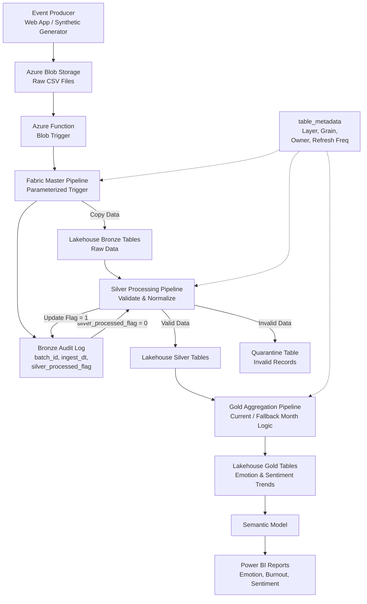

flowchart LR

```mermaid
  
flowchart TD
    %% --------------------
    %% Data Ingestion
    %% --------------------
    SRC[Event Producer<br/>Web App / Synthetic Generator]
    BLOB[Azure Blob Storage<br/>Raw CSV Files]

    SRC --> BLOB

    %% --------------------
    %% Event Trigger
    %% --------------------
    FN[Azure Function<br/>Blob Trigger]
    MP[Fabric Master Pipeline<br/>Parameterized Trigger]

    BLOB --> FN
    FN --> MP

    %% --------------------
    %% Bronze Layer
    %% --------------------
    BRZ[Lakehouse Bronze Tables<br/>Raw Data]
    AUD[Bronze Audit Log<br/>batch_id, ingest_dt,<br/>silver_processed_flag]

    MP -->|Copy Data| BRZ
    MP --> AUD

    %% --------------------
    %% Silver Processing
    %% --------------------
    SILP[Silver Processing Pipeline<br/>Validate & Normalize]
    SIL[Lakehouse Silver Tables]
    QUA[Quarantine Table<br/>Invalid Records]

    AUD -->|silver_processed_flag = 0| SILP
    BRZ --> SILP
    SILP -->|Valid Data| SIL
    SILP -->|Invalid Data| QUA
    SILP -->|Update Flag = 1| AUD

    %% --------------------
    %% Gold Processing
    %% --------------------
    GOLDP[Gold Aggregation Pipeline<br/>Current / Fallback Month Logic]
    GOLD[Lakehouse Gold Tables<br/>Emotion & Sentiment Trends]

    SIL --> GOLDP
    GOLDP --> GOLD

    %% --------------------
    %% Consumption
    %% --------------------
    SEM[Semantic Model]
    PBI[Power BI Reports<br/>Emotion, Burnout, Sentiment]

    GOLD --> SEM
    SEM --> PBI

    %% --------------------
    %% Metadata
    %% --------------------
    META[table_metadata<br/>Layer, Grain,<br/>Owner, Refresh Freq]

    META -.-> MP
    META -.-> SILP
    META -.-> GOLDP


```
